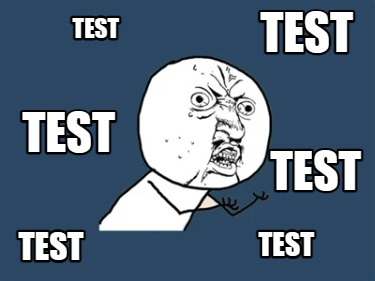
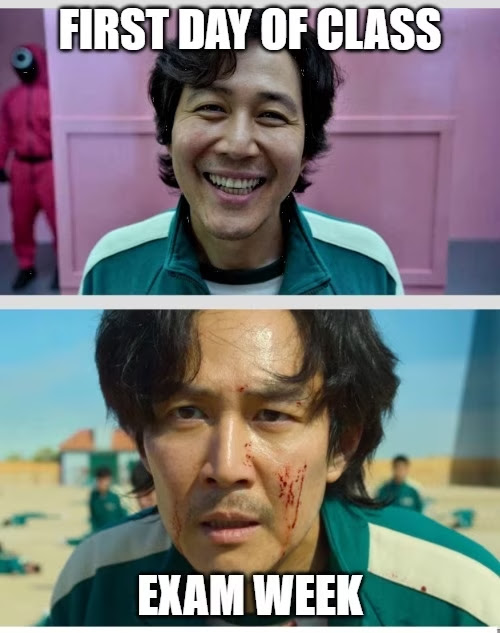
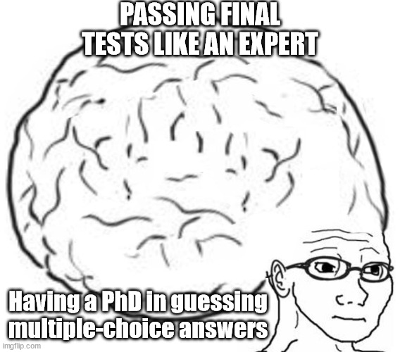
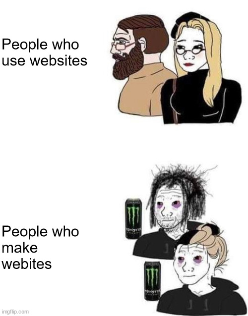

.. title:: Home
Welcome to the documentation for ESL47 - Intermediate-Low Integrated Reading & Writing!
==============================================================================

.. image:: https://readme-typing-svg.herokuapp.com/?font=Righteous&size=35&center=true&vCenter=true&width=600&height=70&duration=5600&lines=Hello+Friends!+%F0%9F%91%8B;
   :align: center

.. rst-class:: center

===================
Are You Ready For The Final Tests?
===================

Behind the screen of people who make websites
-------
.. raw:: html

    

.. note::

   This project is under active development.

Contents
--------
.. toctree::
   unit1.md
   unit2.md
   unit3.md

|say thanks|

.. |say thanks| image:: https://img.shields.io/badge/say-thanks-ff69b4.svg
   :target: https://saythanks.io/to/vpa24