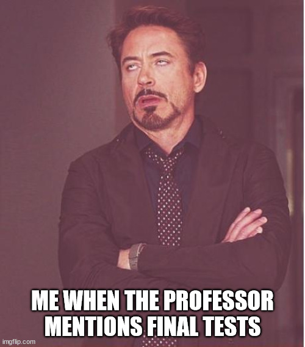

.. title:: Home
Welcome to the documentation for ESL47!
==============================================================================

.. raw:: html

      
🚀🗂️ This webpage will cover all the lessons from Unit 1, Unit 2, Unit 3, and Unit 5. It can help you easily overview and prepare for the upcoming <mark style="background: #FF5582A6; font-weight:bold">FINAL TESTS</mark> 😱.

.. tip::
   .. raw:: html

      You can use the search function located at the top right of the menu bar to help you quickly find any specific informations.

Contents
--------
.. toctree::
   unit1.md
   unit2.md
   unit3.md
   unit5.md

.. note::

   This project is under active development 💪😏. If you have any questions or find any mistakes in this documentation, please email me at: phuonganhvu497@gmail.com 😄😎.

.. raw:: html
   
   
Hello Friends 👋✌️

   
Are You Ready For The Final Tests???

.. image:: _static/images/5622342.jpg
   :align: center

.. image:: _static/images/IMG_3795.AVIF.jpg
   :align: center

.. image:: _static/images/859i2l.jpg
   :align: center
